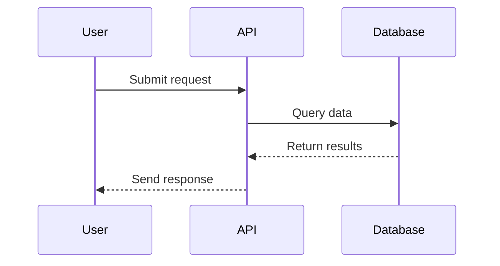

# Requirements Documentation Rules

## Diagram Format

**All diagrams in requirement documents MUST be written in Mermaid format.**

When creating or editing requirement documents (REQ-XXX files):
- Use Mermaid syntax for all visual diagrams
- Wrap diagrams in triple backticks with `mermaid` language identifier
- Supported diagram types:
  - `flowchart` or `graph` - for decision flows and process diagrams
  - `sequenceDiagram` - for API interactions and time-based flows
  - `erDiagram` - for database schemas and data models
  - `classDiagram` - for component architecture
  - `stateDiagram-v2` - for state machines
  - `graph` - for relationship and dependency diagrams

### Example

**Never use:**
- ASCII art diagrams
- External image references
- Other diagram formats (PlantUML, GraphViz, etc.)
- Text-based pseudo-diagrams

**Rationale:** Mermaid diagrams are version-control friendly, render consistently in markdown viewers, and can be easily edited as text.
