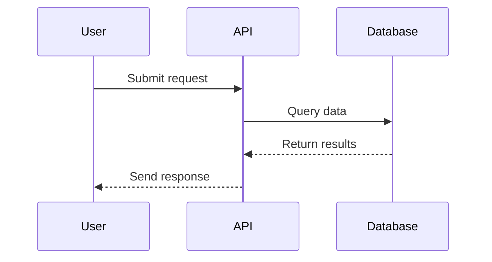

# Requirements Documentation Rules

## Diagram Format

**All diagrams in requirement documents MUST be written in Mermaid format.**

When creating or editing requirement documents (REQ-XXX files):
- Use Mermaid syntax for all visual diagrams
- Wrap diagrams in triple backticks with `mermaid` language identifier
- Supported diagram types:
  - `flowchart` or `graph` - for decision flows and process diagrams
  - `sequenceDiagram` - for API interactions and time-based flows
  - `erDiagram` - for database schemas and data models
  - `classDiagram` - for component architecture
  - `stateDiagram-v2` - for state machines
  - `graph` - for relationship and dependency diagrams

### Example



**Never use:**
- ASCII art diagrams
- External image references
- Other diagram formats (PlantUML, GraphViz, etc.)
- Text-based pseudo-diagrams

**Rationale:** Mermaid diagrams are version-control friendly, render consistently in markdown viewers, and can be easily edited as text.

## Obsidian Properties for Traceability

**A graph is useless if it's just a cloud of dots. You need Traceability.**

Use Obsidian Properties (YAML frontmatter) at the top of requirement notes to create automatic links in the knowledge graph. This enables bidirectional navigation between requirements and wiki pages.

### Required Properties Structure

When creating or editing requirement documents (REQ-XXX files), include these Obsidian-compatible properties:

```yaml
---
type: functional_requirement | non_functional_requirement | technical_requirement
status: draft | in-review | approved | implemented
owner: [[Person Name]]  # Link to wiki/People/ pages
domain: [[Concept Name]]  # Link to wiki/Concepts/ pages
tech_stack: [[Tool 1]], [[Tool 2]]  # Links to wiki/Tools/ pages
related_concepts: [[Concept A]], [[Technique B]]  # Links to wiki/Concepts/ or wiki/Techniques/
---
```

### Example Requirement Note

**File:** `requirements/REQ-001 Automated Lineage Extraction.md`

```markdown
---
id: REQ-001
name: Automated Lineage Extraction
description: Extract lineage metadata from SQL views automatically
type: functional_requirement
status: draft
priority: high
owner: [[John Doe]]  # Links to Wiki/People/john-doe.md
domain: [[Data Lineage]]  # Links to Wiki/Concepts/data-lineage.md
tech_stack: [[dbt]], [[Azure Data Factory]]  # Links to Wiki/Tools/
related_concepts: [[Schema Auditing]], [[Metadata Management]]
related_to:
  - REQ-003
test_cases: []
---

# Notes

## Implementation

### Approach
The system must extract lineage metadata from SQL views automatically using dbt's ref() function parsing and Azure Data Factory's pipeline metadata API...

[Rest of requirement content]
```

### Property Guidelines

**owner:**
- MUST link to a page in `Wiki/People/`
- Format: `[[Full Name]]` (e.g., `[[John Doe]]`)
- Creates bidirectional link: requirement ↔ person

**domain:**
- MUST link to a page in `Wiki/Concepts/`
- Format: `[[Concept Name]]` (e.g., `[[Data Lineage]]`)
- Represents the primary concept area this requirement addresses

**tech_stack:**
- MUST link to pages in `Wiki/Tools/`
- Format: Comma-separated list of `[[Tool Name]]`
- Creates automatic tool usage tracking

**related_concepts:**
- OPTIONAL: Link to pages in `Wiki/Concepts/` or `Wiki/Techniques/`
- Format: Comma-separated list of `[[Concept Name]]`
- Enables cross-domain navigation

### Why This Matters

1. **Automatic Graph Building**: Obsidian automatically creates a graph view showing all connections
2. **Bidirectional Navigation**: Click on a tool page and see all requirements using it
3. **Impact Analysis**: Change a concept and instantly see which requirements are affected
4. **Ownership Tracking**: See all requirements owned by a person from their wiki page
5. **Technology Portfolio**: Visualize which tools are most heavily used

### When Creating Requirements

**write-requirement skill should:**
1. Extract owner from user input and link to `[[Person Name]]`
2. Identify primary domain concept and link to `[[Domain]]`
3. Extract all technologies mentioned and link to `[[Tool]]` pages
4. Add related concepts that were discussed

**wiki-ingest skill should:**
1. Create People pages for owners mentioned in requirements
2. Create Tool pages for tech_stack entries
3. Update Concept pages with requirement references
4. Ensure bidirectional links exist

### Validation

When using `wiki-lint`, check:
- All `owner:` links point to existing `Wiki/People/` pages
- All `domain:` links point to existing `Wiki/Concepts/` pages
- All `tech_stack:` links point to existing `Wiki/Tools/` pages
- Broken links are reported and can be auto-fixed by creating stub pages

**Rationale:** Obsidian Properties create machine-readable, queryable metadata that builds a knowledge graph automatically. This transforms a folder of markdown files into a navigable, interconnected knowledge base where you can trace requirements through concepts, people, and technologies.
