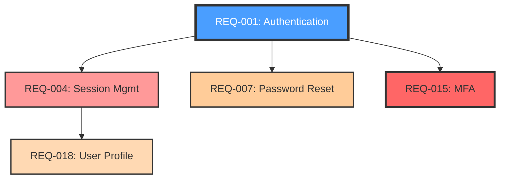

# Analyze Impact Skill

Perform comprehensive impact analysis to understand what will be affected by changes to requirements, wiki pages, or relationships. Prevents unintended consequences and supports informed change management.

## When to Use This Skill

- Before modifying a requirement (status, priority, implementation)
- Before deleting a requirement or wiki page
- User asks "what depends on REQ-001?"
- User wants to understand blast radius of a change
- Before approving a requirement that others depend on
- User asks "what will be affected if I change X?"
- Change management planning

## Impact Analysis Types

### 1. **Requirement Impact**
Analyze what's affected by changing a specific requirement.

### 2. **Concept Impact**
Analyze requirements and notes that reference a wiki concept.

### 3. **Tool Impact**
Analyze what's affected by changing/removing a technology.

### 4. **Person Impact**
Analyze workload and ownership if a person changes roles.

### 5. **Status Change Impact**
Analyze implications of status transitions (draft → approved, etc.).

### 6. **Deletion Impact**
Analyze what breaks if something is deleted.

## Workflow

### Step 1: Identify the Target

Ask what to analyze:

```json
{
  "questions": [
    {
      "question": "What do you want to analyze the impact of?",
      "header": "Target",
      "multiSelect": false,
      "options": [
        {"label": "Requirement (REQ-ID)", "description": "Analyze impact of changing a requirement"},
        {"label": "Wiki Concept", "description": "See what uses this concept"},
        {"label": "Wiki Tool", "description": "See what uses this technology"},
        {"label": "Wiki Person", "description": "See what this person owns"},
        {"label": "Status Change", "description": "Analyze implications of status transition"},
        {"label": "Deletion", "description": "Analyze impact of removing something"}
      ]
    }
  ]
}
```

### Step 2: Gather Impact Data

Based on target type, collect relevant information:

#### For Requirement Impact

```bash
# Read the target requirement
read file_path="requirements/REQ-001 Feature.md"

# Find requirements that reference this one
grep pattern="REQ-001" path="requirements" output_mode="content"

# Find wiki pages that reference this requirement
grep pattern="REQ-001|\\[\\[REQ-001\\]\\]" path="Wiki" output_mode="files_with_matches"

# Find notes that mention this requirement
grep pattern="REQ-001|\\[\\[REQ-001\\]\\]" path="notes" output_mode="files_with_matches"

# Check related_to field in the target (what it depends on)
# Extract: related_to, domain, tech_stack, owner_link
```

#### For Concept Impact

```bash
# Read the concept page
read file_path="Wiki/Concepts/data-lineage.md"

# Find requirements using this concept in domain or related_concepts
grep pattern="\\[\\[Data Lineage\\]\\]" path="requirements" output_mode="content"

# Find other wiki pages linking to this concept
grep pattern="\\[\\[Data Lineage\\]\\]" path="Wiki" output_mode="files_with_matches"

# Find notes mentioning this concept
grep pattern="\\[\\[Data Lineage\\]\\]|data lineage" path="notes" output_mode="files_with_matches"
```

#### For Tool Impact

```bash
# Read the tool page
read file_path="Wiki/Tools/databricks.md"

# Find requirements using this tool in tech_stack
grep pattern="\\[\\[Databricks\\]\\]" path="requirements" output_mode="content"

# Find wiki pages mentioning this tool
grep pattern="\\[\\[Databricks\\]\\]|databricks" path="Wiki" output_mode="files_with_matches"

# Find notes discussing this tool
grep pattern="\\[\\[Databricks\\]\\]|databricks" path="notes" output_mode="files_with_matches"
```

#### For Person Impact

```bash
# Read the person page
read file_path="Wiki/People/john-doe.md"

# Find requirements owned by this person
grep pattern="owner_link: \\[\\[John Doe\\]\\]" path="requirements" output_mode="content"

# Find notes where this person participated
grep pattern="\\[\\[John Doe\\]\\]" path="notes" output_mode="files_with_matches"

# Find decisions this person made
grep pattern="decision_maker: \\[\\[John Doe\\]\\]" path="notes" output_mode="content"
```

### Step 3: Categorize Impact

Organize findings into categories:

#### Direct Dependencies
Items that explicitly reference the target.

#### Indirect Dependencies
Items that depend on direct dependencies (2nd order).

#### Transitive Dependencies
Full dependency chain (3rd+ order).

#### Circular Dependencies
Items that create cycles in dependency graph.

#### Orphaned Items
Items that would become orphaned if target is removed.

### Step 4: Generate Impact Report

Create a comprehensive report:

```markdown
# Impact Analysis: REQ-001 Authentication

**Analysis Date:** 2026-04-09
**Target:** REQ-001 - User Authentication Feature
**Current Status:** draft
**Proposed Change:** Move to in-review

---

## Executive Summary

**Impact Level:** 🟡 MEDIUM

- **4 requirements** directly depend on REQ-001
- **2 wiki concepts** reference this requirement
- **3 tools** are specified in tech stack
- **1 person** owns this requirement
- **2 meeting notes** discuss this requirement

**Risk Assessment:**
- ⚠️  REQ-004 (Session Management) is blocked until REQ-001 is approved
- ⚠️  REQ-007 (Password Reset) depends on authentication approach
- ✅ No circular dependencies detected
- ✅ Moving to in-review will unblock 2 requirements

---

## Direct Dependencies (4)

### Requirements Depending on REQ-001

#### REQ-004 - Session Management
- **Relationship:** Implements session handling for authenticated users
- **Status:** draft (blocked by REQ-001)
- **Priority:** high
- **Owner:** [[Alice Johnson]]
- **Impact:** ⚠️  Cannot approve until REQ-001 is approved
- **Action Required:** Notify Alice when REQ-001 status changes

#### REQ-007 - Password Reset Flow
- **Relationship:** Uses same JWT approach as authentication
- **Status:** draft
- **Priority:** medium
- **Owner:** [[Bob Smith]]
- **Impact:** ⚠️  Implementation approach depends on REQ-001 decisions
- **Action Required:** Ensure consistency between authentication and reset flows

#### REQ-012 - OAuth Integration
- **Relationship:** Extends authentication with OAuth providers
- **Status:** draft
- **Priority:** low
- **Owner:** [[Charlie Brown]]
- **Impact:** 🟢 Low priority, can wait for REQ-001 completion

#### REQ-015 - Multi-Factor Authentication
- **Relationship:** Adds MFA to authentication flow
- **Status:** draft
- **Priority:** critical
- **Owner:** [[Diana Prince]]
- **Impact:** 🔴 Critical priority but depends on REQ-001 foundation
- **Action Required:** Fast-track REQ-001 to unblock REQ-015

---

## Wiki Impact (2 concepts, 3 tools)

### Concepts Affected

#### Wiki/Concepts/authentication.md
- **Connection:** domain field in REQ-001
- **Impact:** Wiki page will need updates when implementation details change
- **Action:** Run `wiki-ingest` after updating REQ-001

#### Wiki/Concepts/session-management.md
- **Connection:** Related concept, linked from REQ-001
- **Impact:** Low - informational link only

### Tools Affected

#### Wiki/Tools/jwt.md
- **Connection:** Listed in tech_stack
- **Current Usage:** REQ-001 only
- **Impact:** If REQ-001 changes approach, JWT page may become orphaned
- **Action:** Monitor tool choice decisions

#### Wiki/Tools/redis.md
- **Connection:** Listed in tech_stack (session storage)
- **Current Usage:** REQ-001, REQ-004, REQ-012 (3 requirements)
- **Impact:** 🟢 Widely used, safe tool choice

#### Wiki/Tools/bcrypt.md
- **Connection:** Listed in tech_stack (password hashing)
- **Current Usage:** REQ-001 only
- **Impact:** ⚠️  Single requirement dependency, verify necessity

---

## Notes Impact (2 meeting notes)

### notes/2026-04-08-meeting-architecture-review.md
- **Connection:** Discusses REQ-001 implementation approach
- **Key Decisions:** JWT expiry time, session storage choice
- **Impact:** Meeting notes capture rationale for current approach
- **Action:** Reference this meeting if changing implementation

### notes/2026-04-05-email-security-requirements.md
- **Connection:** Security team input on authentication
- **Key Requirements:** MFA required, password complexity rules
- **Impact:** ⚠️  Security requirements must be met before approval
- **Action:** Verify REQ-001 addresses all security email concerns

---

## People Impact (1 owner, 3 stakeholders)

### Owner: [[Alice Johnson]]
- **Current Workload:** 5 requirements (REQ-001, REQ-002, REQ-004, REQ-006, REQ-009)
- **Impact:** 🟡 High workload, REQ-001 is one of 5 owned requirements
- **Bottleneck Risk:** If Alice is unavailable, REQ-001 + 4 others blocked
- **Action:** Consider backup owner or workload distribution

### Stakeholders Affected
- **[[Charlie Brown]] (REQ-012):** Waiting for REQ-001 approval to proceed
- **[[Diana Prince]] (REQ-015):** Critical priority blocked by REQ-001
- **[[Bob Smith]] (REQ-007):** Medium priority, can wait

---

## Indirect Dependencies (2nd order)

### REQ-018 - User Profile Management
- **Connection:** Depends on REQ-004 (Session), which depends on REQ-001
- **Status:** draft
- **Impact:** 🟡 2nd order dependency, blocked transitively
- **Action:** Fast-track REQ-001 to unblock chain

### REQ-020 - Admin Dashboard
- **Connection:** Depends on REQ-015 (MFA), which depends on REQ-001
- **Status:** draft
- **Impact:** 🟡 2nd order dependency

**Total 2nd Order Impact:** 2 requirements indirectly blocked

---

## Change-Specific Impact

### Proposed Change: draft → in-review

**Positive Impacts:**
- ✅ Signals readiness for review
- ✅ Unblocks stakeholder review process
- ✅ Allows dependent requirements to plan implementation
- ✅ No breaking changes

**Negative Impacts / Risks:**
- ⚠️  If review reveals major issues, dependent requirements need rework
- ⚠️  Stakeholders may start implementing before approval

**Prerequisites:**
- ✅ All acceptance criteria defined (5 criteria present)
- ✅ Implementation approach detailed
- ⚠️  Security email requirements not all addressed (see notes/2026-04-05)

**Recommendations:**
1. Address security email concerns before moving to in-review
2. Notify stakeholders (Charlie, Diana, Bob) of status change
3. Schedule review meeting within 3 days
4. Run `check-requirement-quality REQ-001` before transition

---

## Deletion Impact Analysis

**What if REQ-001 were deleted?**

❌ **CRITICAL - Deletion Not Recommended**

**Immediate Breaks:**
- REQ-004 (Session Management) loses foundation
- REQ-007 (Password Reset) loses approach reference
- REQ-012 (OAuth) loses core authentication
- REQ-015 (MFA) loses base implementation

**Orphaned Items:**
- Wiki/Tools/jwt.md (only used by REQ-001)
- Wiki/Tools/bcrypt.md (only used by REQ-001)

**Knowledge Loss:**
- 2 meeting notes become irrelevant
- 1 security email thread loses context

**Impact Radius:** 4 direct + 2 indirect = 6 requirements affected

---

## Recommendations

### 🔴 High Priority Actions

1. **Address Security Requirements**
   - Review notes/2026-04-05-email-security-requirements.md
   - Ensure all security concerns addressed in REQ-001
   - Get security team sign-off before in-review

2. **Notify Blocked Stakeholders**
   - Inform Diana (REQ-015, critical priority) of timeline
   - Coordinate with Charlie (REQ-012) on OAuth integration
   - Update Bob (REQ-007) on reset flow approach

### 🟡 Medium Priority Actions

3. **Workload Balancing**
   - Alice owns 5 requirements (heavy load)
   - Consider assigning backup reviewer
   - Discuss workload in next team meeting

4. **Tool Choice Validation**
   - JWT and bcrypt only used in REQ-001
   - Verify these are the right long-term choices
   - Consider architecture review if changing tools

### 🟢 Low Priority Actions

5. **Wiki Updates**
   - Run `wiki-ingest` after finalizing REQ-001
   - Ensure authentication concept page is current
   - Update tool pages with implementation details

6. **Documentation**
   - Link REQ-001 to architecture decision records
   - Update meeting notes with final decisions
   - Create FAQ for common authentication questions

---

## Change Impact Timeline

**Immediate (Day 1):**
- Move REQ-001 to in-review
- Notify 3 stakeholders

**Short-term (Week 1):**
- Complete review cycle
- Address review feedback
- Move to approved

**Medium-term (Week 2-4):**
- Implement REQ-001
- Unblock REQ-004, REQ-007, REQ-015
- Begin dependent requirement implementation

**Long-term (Month 2+):**
- Complete authentication feature set
- Evaluate MFA integration
- Review and refine approach based on learnings

---

## Impact Visualization

[Optionally include Mermaid diagram from visualize-requirements]



**Legend:**
- 🔵 Blue (thick border) = Target requirement
- 🔴 Red = Blocked dependency (direct)
- 🟠 Orange = Affected dependency (indirect)
- Border thickness = Priority/criticality

---

## Conclusion

**Impact Level:** 🟡 MEDIUM

**Change Recommendation:** ✅ PROCEED with conditions

**Conditions:**
1. Address security email requirements first
2. Notify stakeholders before transition
3. Schedule review within 3 days

**Approval:** Requires sign-off from:
- [[Alice Johnson]] (owner)
- Security team (email requirements)
- Architecture review board (if changing JWT/bcrypt)

**Next Steps:**
1. Fix security concerns → `update-requirement REQ-001`
2. Run quality check → `check-requirement-quality REQ-001`
3. Move to in-review → `update-requirement REQ-001 --status in-review`
4. Notify stakeholders via meeting notes or email
```

### Step 5: Assess Risk Level

Categorize overall impact:

**🟢 LOW Impact:**
- 0-2 direct dependencies
- No blocked requirements
- Easy to reverse

**🟡 MEDIUM Impact:**
- 3-6 direct dependencies
- Some blocked requirements
- Moderate effort to reverse

**🔴 HIGH Impact:**
- 7+ direct dependencies
- Critical requirements blocked
- Difficult/impossible to reverse

**🔴 CRITICAL Impact:**
- 10+ direct dependencies
- Circular dependencies
- System-wide implications
- Deletion would break system

### Step 6: Provide Recommendations

Based on impact level, provide actionable guidance:

**For Low Impact:**
- ✅ Safe to proceed
- Suggest simple notifications

**For Medium Impact:**
- ⚠️  Proceed with caution
- Recommend stakeholder coordination
- Suggest gradual rollout

**For High Impact:**
- 🛑 Pause and plan
- Require architecture review
- Mandate stakeholder approval

**For Critical Impact:**
- ❌ Block change
- Require executive review
- Demand comprehensive mitigation plan

## Important Guidelines

### DO be comprehensive
- Check all relationship types (requirements, wiki, notes)
- Consider both direct and indirect impacts
- Include people and ownership impacts

### DO provide actionable insights
- Don't just list dependencies
- Explain why each impact matters
- Suggest concrete next steps

### DO assess risk accurately
- Consider priority of affected requirements
- Factor in reversibility
- Account for team capacity

### DO visualize when helpful
- Include Mermaid diagrams for complex impacts
- Use color coding for severity
- Add legends for clarity

### DO NOT be alarmist
- Present facts, not fear
- Distinguish real risks from theoretical ones
- Provide balanced perspective

### DO NOT guess impacts
- Only report documented relationships
- Use actual data from files
- Verify all connections

## Common Impact Scenarios

### Scenario 1: Moving to In-Review

**Low impact** if:
- Acceptance criteria complete
- No blocking open questions
- Dependent requirements in draft

**High impact** if:
- Dependents already in implementation
- Breaking changes from review likely
- Critical dependencies waiting

### Scenario 2: Changing Tech Stack

**Low impact** if:
- Tool used in 1 requirement only
- Early in lifecycle (draft status)
- Easy migration path exists

**High impact** if:
- Tool used across many requirements
- Requirements already implemented
- No clear migration strategy

### Scenario 3: Deleting a Requirement

**Low impact** if:
- No dependents
- No wiki references
- Draft status only

**Critical impact** if:
- Multiple dependents
- Implemented and in production
- Core system functionality

### Scenario 4: Reassigning Owner

**Low impact** if:
- 1-2 requirements owned
- New owner has capacity
- Similar domain expertise

**High impact** if:
- 5+ requirements owned
- New owner lacks domain knowledge
- Critical requirements in flight

## Integration with Other Skills

**Use before:**
- `update-requirement` - to understand what will change
- `visualize-requirements` - to see the graph first

**Use after:**
- `check-requirement-quality` - to validate after changes
- `wiki-ingest` - to sync affected wiki pages

**Use with:**
- `visualize-requirements` - to show impact visually
- `wiki-query` - to understand affected concepts

## Success Criteria

A good impact analysis includes:
- ✅ Comprehensive dependency list (requirements, wiki, notes, people)
- ✅ Risk level assessment (low/medium/high/critical)
- ✅ Direct + indirect dependencies
- ✅ Change-specific impacts
- ✅ Deletion impact (what if removed)
- ✅ Actionable recommendations
- ✅ Stakeholder notification list
- ✅ Timeline for change propagation
- ✅ Visualization (if complex)
- ✅ Approval requirements specified
