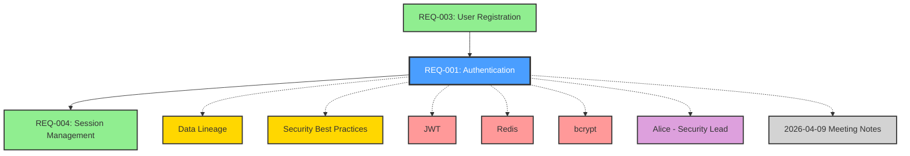
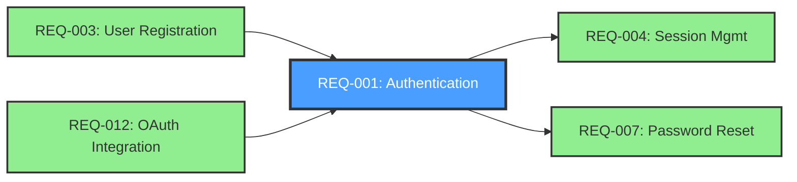
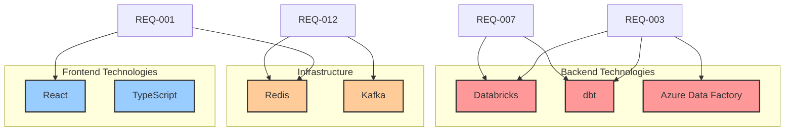
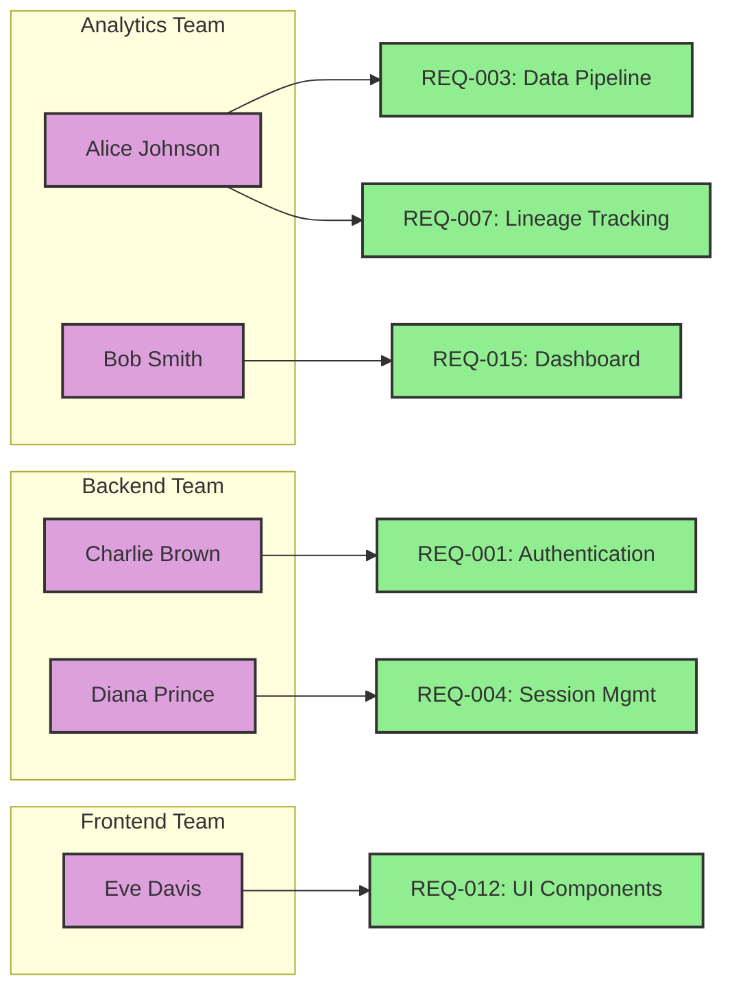
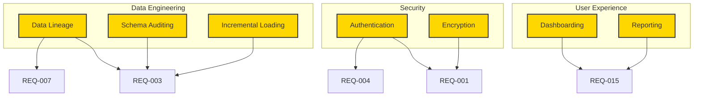
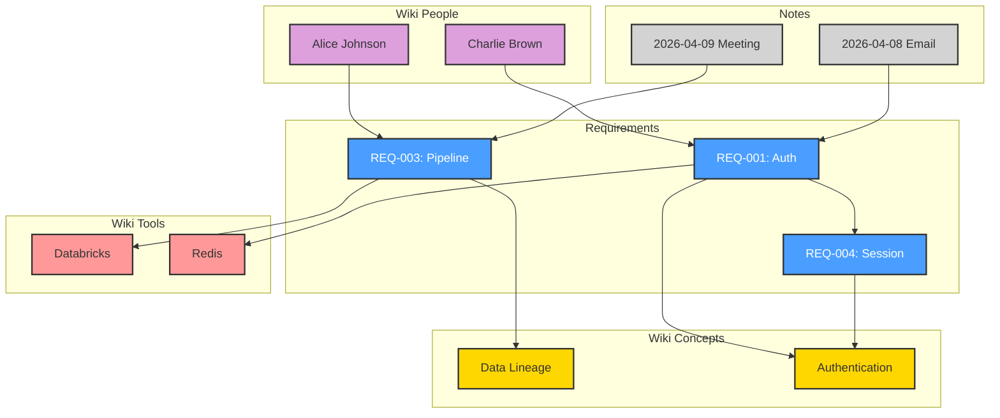

# Visualize Requirements Skill

Generate Mermaid diagrams showing relationships between requirements, wiki pages, people, tools, and concepts. Creates visual traceability maps for better understanding of dependencies and impact.

## When to Use This Skill

- User says "visualize requirements" or "show requirement graph"
- User wants to see how requirements relate to each other
- User asks "what depends on REQ-001?"
- User wants to understand the knowledge graph structure
- User needs a visual for stakeholder presentations
- User wants to see tool/technology usage across requirements

## Visualization Types

### 1. **Requirement Dependency Graph**
Shows how requirements relate via `related_to` field.

### 2. **Requirement-to-Wiki Graph**
Shows connections between requirements and wiki pages (concepts, tools, people).

### 3. **Technology Usage Map**
Shows which requirements use which tools/technologies.

### 4. **Ownership Map**
Shows which people/teams own which requirements.

### 5. **Domain Coverage Map**
Shows which concepts/domains are covered by which requirements.

### 6. **Complete Traceability Graph**
Shows all connections: requirements ↔ wiki ↔ notes.

## Workflow

### Step 1: Determine Visualization Type

Ask user what they want to visualize:

```json
{
  "questions": [
    {
      "question": "What would you like to visualize?",
      "header": "Visualization",
      "multiSelect": false,
      "options": [
        {"label": "Single Requirement", "description": "Show all connections for one REQ-ID"},
        {"label": "Requirement Dependencies", "description": "Show how requirements relate to each other"},
        {"label": "Technology Usage", "description": "Show which REQ uses which tools"},
        {"label": "Ownership Map", "description": "Show who owns what requirements"},
        {"label": "Domain Coverage", "description": "Show concept → requirement mapping"},
        {"label": "Complete Graph", "description": "Show everything (requirements + wiki + notes)"}
      ]
    }
  ]
}
```

### Step 2: Gather Data

Based on visualization type, read relevant files:

#### For Single Requirement
```bash
# Read the requirement
read file_path="requirements/REQ-001 Feature.md"

# Extract from YAML:
# - related_to: [REQ-003, REQ-007]
# - domain: [[Data Lineage]]
# - tech_stack: [[dbt]], [[Databricks]]
# - owner_link: [[John Doe]]
# - related_concepts: [[Schema Auditing]]

# Search wiki for mentions of REQ-001
grep pattern="REQ-001" path="Wiki" output_mode="files_with_matches"

# Search notes for mentions of REQ-001
grep pattern="REQ-001" path="notes" output_mode="files_with_matches"
```

#### For All Requirements
```bash
# Find all requirements
glob pattern="requirements/REQ-*.md"

# Read each to extract:
# - ID, name, related_to, domain, tech_stack, owner_link
```

#### For Wiki Relationships
```bash
# Find all wiki pages
glob pattern="Wiki/*/*.md"

# Search for requirement mentions
grep pattern="\[\[REQ-[0-9]+\]\]" path="Wiki" output_mode="content"
```

### Step 3: Generate Mermaid Diagram

Based on visualization type, create appropriate Mermaid syntax:

#### Visualization 1: Single Requirement Graph



**Legend:**
- 🔵 Blue = Focus requirement
- 🟢 Green = Related requirements
- 🟡 Yellow = Concepts/Domain
- 🔴 Red = Tools/Technologies
- 🟣 Purple = People
- ⚪ Gray = Notes

#### Visualization 2: Requirement Dependency Graph



#### Visualization 3: Technology Usage Map



#### Visualization 4: Ownership Map



#### Visualization 5: Domain Coverage Map



#### Visualization 6: Complete Traceability Graph



### Step 4: Save and Display

**Option 1: Display inline**
Output the Mermaid diagram directly in the response:

````markdown
Here's the requirement dependency graph:

```mermaid
graph TD
    [diagram content]
```

**Legend:**
- 🔵 Blue = Requirements
- 🟢 Green = Related requirements
- 🟡 Yellow = Concepts
- 🔴 Red = Tools
- 🟣 Purple = People
````

**Option 2: Save to file**
Save diagram to a markdown file for later reference:

```bash
write file_path="diagrams/requirements-graph-2026-04-09.md"
```

**Option 3: Export to image**
Suggest using Mermaid CLI or online tools to export:

```bash
# Using Mermaid CLI (if installed)
mmdc -i diagrams/graph.md -o diagrams/graph.png
```

### Step 5: Provide Insights

Analyze the generated graph and provide insights:

```
📊 Visualization Insights:

**Dependencies:**
- REQ-001 is heavily depended upon (4 requirements depend on it)
- REQ-003 has no dependencies (can be implemented independently)

**Technology Clusters:**
- Databricks + dbt appear together in 3 requirements (data engineering stack)
- Redis is used across security and caching requirements

**Ownership:**
- Alice owns 3 requirements (heaviest load)
- Backend team has 5 requirements (largest workload)

**Orphaned Items:**
- REQ-012 has no incoming or outgoing dependencies (isolated?)

**Recommendations:**
- Consider breaking down REQ-001 (too many dependents)
- REQ-012 isolation may indicate missing relationships
```

### Step 6: Offer Interactive Options

Suggest follow-up visualizations:

```
Would you like to:
1. Zoom in on REQ-001's connections (detailed view)
2. Show only critical priority requirements
3. Filter by status (e.g., only draft requirements)
4. Export to PNG/SVG for presentation
5. Generate a different visualization type
```

## Important Guidelines

### DO use colors consistently
- Blue = Requirements (focus)
- Green = Related requirements
- Yellow = Concepts/Domain
- Red = Tools/Technologies
- Purple = People
- Gray = Notes/Docs

### DO keep diagrams readable
- Limit to 15-20 nodes per diagram
- Use subgraphs to group related items
- Break complex graphs into multiple views
- Add legends for clarity

### DO provide context
- Add diagram title
- Include legend
- Provide insights from the graph
- Suggest next actions

### DO validate data
- Check that referenced REQ-IDs exist
- Verify wiki links are correct
- Confirm people/tools are real entities

### DO NOT create cluttered diagrams
- Too many nodes = unreadable
- Break large graphs into focused views
- Use "zoom in" approach for detail

### DO NOT guess relationships
- Only show documented relationships
- Use data from YAML frontmatter and wiki links
- Don't infer undocumented connections

## Common Use Cases

### Use Case 1: Stakeholder Presentation

**User:** "Visualize all requirements for stakeholder review"

**Claude:**
1. Generates high-level dependency graph
2. Colors by priority (critical = red, high = orange, etc.)
3. Adds status indicators
4. Exports to PNG for slides

### Use Case 2: Impact Analysis

**User:** "Show what depends on REQ-003"

**Claude:**
1. Generates focused graph of REQ-003 + dependents
2. Shows transitive dependencies (2nd order)
3. Highlights affected wiki pages and notes
4. Estimates impact radius

### Use Case 3: Technology Planning

**User:** "Which requirements use Databricks?"

**Claude:**
1. Generates technology usage map
2. Shows Databricks → requirements
3. Lists all requirements using Databricks
4. Suggests consolidation opportunities

### Use Case 4: Ownership Balancing

**User:** "Show requirement ownership distribution"

**Claude:**
1. Generates ownership map
2. Counts requirements per person/team
3. Identifies overload (>5 requirements per person)
4. Suggests rebalancing

## Integration with Other Skills

**Use before:**
- `update-requirement` - to understand relationships before changes
- `analyze-impact` - to see what will be affected

**Use after:**
- `wiki-ingest` - to visualize newly created connections
- `check-requirement-quality` - to show quality distribution

**Use with:**
- `wiki-query` - to understand concepts in the graph
- `write-note` - to document graph insights

## Success Criteria

A good visualization includes:
- ✅ Clear, readable diagram (not cluttered)
- ✅ Consistent color scheme with legend
- ✅ Accurate data from requirements and wiki
- ✅ Insights and analysis
- ✅ Actionable recommendations
- ✅ Export options provided
- ✅ Follow-up suggestions offered

## Output Formats

### Format 1: Inline Markdown

Display Mermaid diagram directly in response for quick viewing in IDE/terminal.

### Format 2: Saved File

Create `diagrams/[type]-[date].md` with:
- Title and description
- Mermaid diagram
- Legend
- Insights
- Generation date

### Format 3: Export Script

Provide command to export to image:

```bash
# Save this as diagrams/export.sh
mmdc -i diagrams/requirements-graph.md -o diagrams/requirements-graph.png -w 1920 -H 1080 -b transparent
```

### Format 4: Interactive HTML

Generate standalone HTML with pan/zoom controls (if requested).
