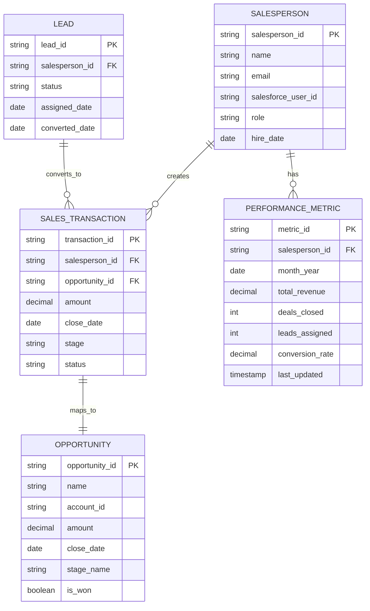

# Notes

## Implementation

### Approach

This requirement integrates Salesforce CRM data into a Business Intelligence tool (Tableau or Power BI) to provide managers with performance comparison dashboards.

**Data Integration:**
- Connect to Salesforce API using OAuth 2.0 authentication
- Extract sales transaction data from Opportunity and OpportunityLineItem objects
- Pull user data from User object to map salespeople
- Schedule automated ETL jobs (daily refresh at 2 AM) to sync data to BI tool's data warehouse
- Store historical snapshots to enable year-over-year and arbitrary month comparisons

**Data Model:**
- Create aggregated performance metrics table with fields:
  - `salesperson_id` (FK to User)
  - `month_year` (date, format: YYYY-MM)
  - `total_revenue` (decimal, sum of closed-won opportunity amounts)
  - `deals_closed` (integer, count of closed-won opportunities)
  - `leads_assigned` (integer, from Lead object where Status = 'Assigned')
  - `conversion_rate` (calculated: deals_closed / leads_assigned * 100)
  - `last_updated` (timestamp)

**Dashboard Components:**
- **Comparison Table:** Side-by-side view with columns for each selected time period, delta indicators (+/-), and percentage change
- **Trend Charts:** Line charts showing metric progression over selected time range
- **Top Performers:** Ranked list of salespeople by selected metric
- **Filters:** Date range picker (any two months, quarters, or year-over-year), salesperson selector, metric toggle

**Access Control:**
- Implement row-level security in BI tool to restrict data visibility
- Only users with "Sales Manager" role in Salesforce can access the dashboard
- Use Salesforce permission sets to determine manager access levels

**Performance Considerations:**
- Pre-aggregate metrics monthly to avoid real-time calculations
- Cache dashboard queries for 1 hour to reduce API load
- Limit historical data retention to 36 months (rolling window)

### Key decisions

- **BI tool over custom web app:** Leverages existing Tableau/Power BI licenses and expertise, faster time to implementation than building from scratch
- **Daily data refresh instead of real-time:** Sales performance is evaluated monthly, so real-time sync is unnecessary and would increase API costs
- **Manager-only access in v1:** Limits scope and data privacy concerns; salesperson self-service can be added in v2
- **Pre-aggregated metrics:** Improves dashboard load time and reduces Salesforce API call volume
- **36-month data retention:** Balances historical analysis needs with storage costs

### Out of scope

- Real-time performance updates (dashboard refreshes daily)
- Salesperson access to their own data (managers only in v1)
- Forecasting or predictive analytics
- Integration with other CRM systems besides Salesforce
- Mobile app version (web dashboard only)
- Email alerts or automated reports
- Team-level aggregations (individual salesperson focus only)

### Open questions

- [ ] Should the dashboard support exporting data to CSV or PDF for offline analysis? — pending manager feedback, assigned to @product-team
- [ ] Do we need to track additional metrics like average deal size or sales cycle length? — pending stakeholder review, assigned to @sales-leadership
- [ ] Should historical data older than 36 months be archived or permanently deleted? — pending compliance review, assigned to @legal-team
- [ ] What level of Salesforce API rate limiting should we plan for? — pending infrastructure assessment, assigned to @devops-team

### References

- Salesforce Opportunity Object API docs: https://developer.salesforce.com/docs/atlas.en-us.object_reference.meta/object_reference/sforce_api_objects_opportunity.htm
- Tableau Salesforce Connector: https://help.tableau.com/current/pro/desktop/en-us/examples_salesforce.htm
- Power BI Salesforce integration: https://learn.microsoft.com/en-us/power-bi/connect-data/service-connect-to-salesforce

## Acceptance Criteria

- [ ] **AC-1:** Manager can select any two months (e.g., October 2025 vs November 2025) and view comparison table with total revenue, deals closed, and conversion rate for each salesperson
- [ ] **AC-2:** Dashboard displays year-over-year comparison (e.g., November 2024 vs November 2025) when manager selects that option
- [ ] **AC-3:** Quarterly summary view aggregates data for Q1, Q2, Q3, Q4 when selected
- [ ] **AC-4:** Rolling 12-month view displays performance trend charts for the trailing year
- [ ] **AC-5:** Delta indicators show +/- changes and percentage differences between compared time periods
- [ ] **AC-6:** Only users with "Sales Manager" role in Salesforce can access the dashboard
- [ ] **AC-7:** Data refreshes daily at 2 AM with latest Salesforce transactions
- [ ] **AC-8:** Dashboard loads within 3 seconds for datasets up to 50 salespeople across 36 months
- [ ] **AC-9:** Conversion rate is calculated correctly as (deals_closed / leads_assigned * 100)
- [ ] **AC-10:** Historical data is available for up to 36 months from current date

# Diagrams

## Entity-Relationship Diagram

