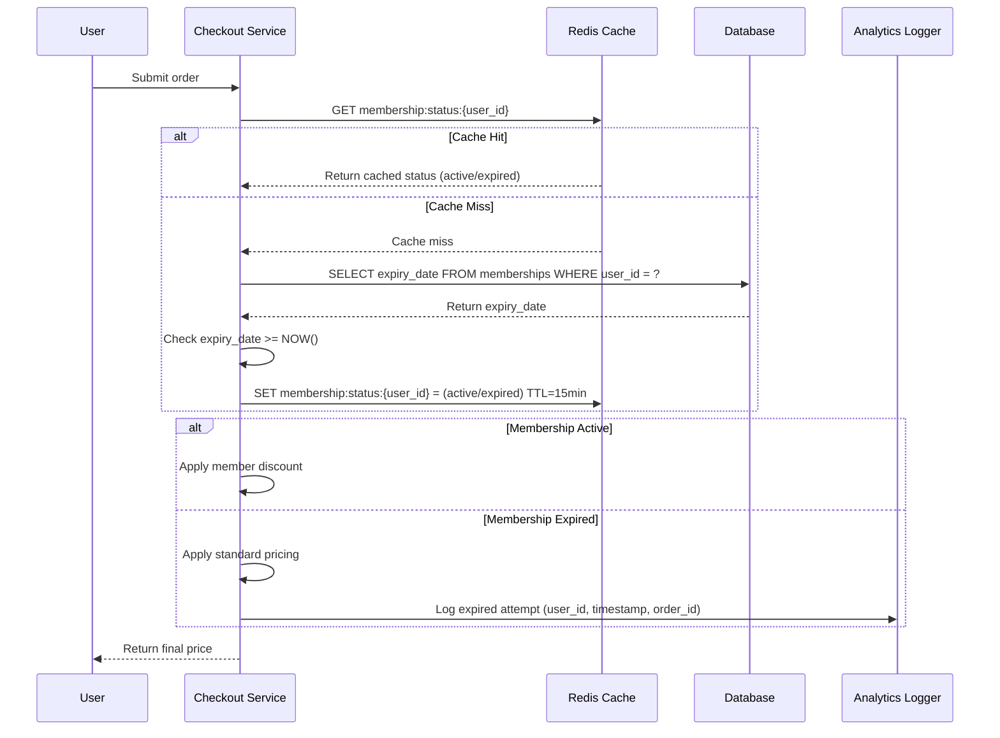

# Notes

## Implementation

### Approach

During checkout/payment processing, the system validates membership status before calculating the final price. The validation checks the `expiry_date` field from the `users.memberships` table (or related membership table) to determine if the membership is currently active.

The validation flow works as follows:
1. **Cache lookup**: Check Redis/cache for membership status using key `membership:status:{user_id}` with a 15-minute TTL
2. **Cache miss**: Query the database: `SELECT expiry_date FROM memberships WHERE user_id = ? AND expiry_date >= CURRENT_TIMESTAMP`
3. **Cache update**: Store the result (active/expired) in cache with 15-minute expiration
4. **Price calculation**:
   - If membership is active (`expiry_date >= current time`): Apply member discount
   - If membership is expired: Apply standard pricing silently (no discount, no user notification)
5. **Logging**: Log all expired membership discount attempts with `user_id`, `timestamp`, and `order_id` to an analytics table or log aggregator (e.g., `discount_validation_logs` table or structured JSON logs)

**Database schema assumptions:**
- Membership table has `expiry_date` field (DATETIME or TIMESTAMP)
- Simple binary check: active if `expiry_date >= NOW()`, expired otherwise
- No grace periods or special states (pending, suspended, lifetime) in this requirement

**Performance considerations:**
- Cache layer reduces database load from O(n) queries per checkout to O(1) cache lookups
- 15-minute TTL balances freshness (users who renew see updated status within 15 min) with performance
- Batch checkouts (multiple items) share a single membership validation

### Key decisions

- **Silent failure (no user notification):** Applying standard pricing without showing an error message prevents confusion during checkout. Users see the correct non-discounted price without interruption. This differs from explicit "membership expired" errors which could cause cart abandonment.
- **15-minute cache TTL:** Balances performance (reduces DB queries) with data freshness. Users who renew their membership will see the discount applied within 15 minutes, which is acceptable for most use cases.
- **Validation at checkout only:** Validating at checkout (not at cart-add time) simplifies the implementation and allows users to browse with expired memberships. The validation happens once when it matters most.
- **Log all attempts:** Logging expired membership discount attempts provides analytics on renewal patterns and can detect potential fraud (e.g., users exploiting expired memberships).

### Out of scope

- Grace periods after expiration (e.g., 7-day grace period)
- Proactive notifications to users about expired memberships
- Frontend UI indicators showing membership status before checkout
- Handling special membership states (pending renewal, suspended, lifetime)
- Automatic membership renewal or payment retry logic
- Multi-tier membership levels with different discount rates (assumes single member/non-member distinction)

### Open questions

- [ ] Should the system send an email reminder when an expired member attempts to use a discount? — pending decision from marketing team, assigned to @product-owner
- [ ] What analytics/BI tool will consume the discount validation logs? — pending decision from data team, assigned to @data-engineer

### References

- Internal membership database schema documentation (if available)
- Cache layer architecture documentation (Redis configuration, TTL policies)
- Checkout API documentation (price calculation endpoints)
- Analytics/logging pipeline documentation

## Acceptance Criteria

- [ ] **AC-1:** Active membership (expiry_date >= current time) receives member discount during checkout
- [ ] **AC-2:** Expired membership (expiry_date < current time) receives standard pricing (no discount applied)
- [ ] **AC-3:** Membership status is cached for 15 minutes after first lookup
- [ ] **AC-4:** Cache hits do not query the database for membership status
- [ ] **AC-5:** Cache misses query the database and update the cache with 15-minute TTL
- [ ] **AC-6:** Expired membership discount attempts are logged with user_id, timestamp, and order_id
- [ ] **AC-7:** No user-facing error message is shown when membership is expired (silent standard pricing)
- [ ] **AC-8:** System handles NULL or missing expiry_date as expired membership

# Diagrams

